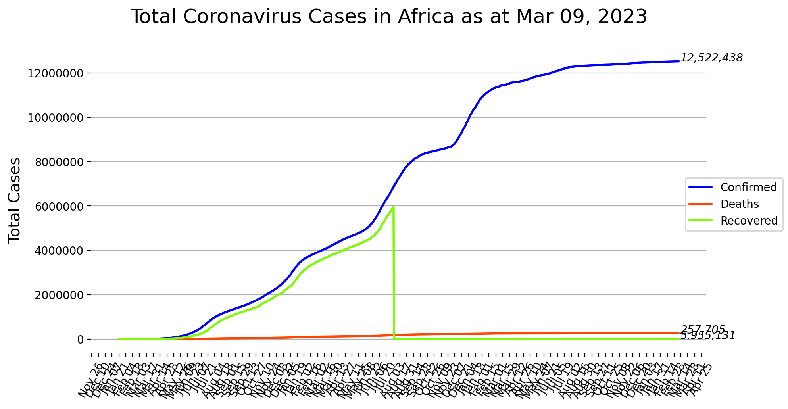
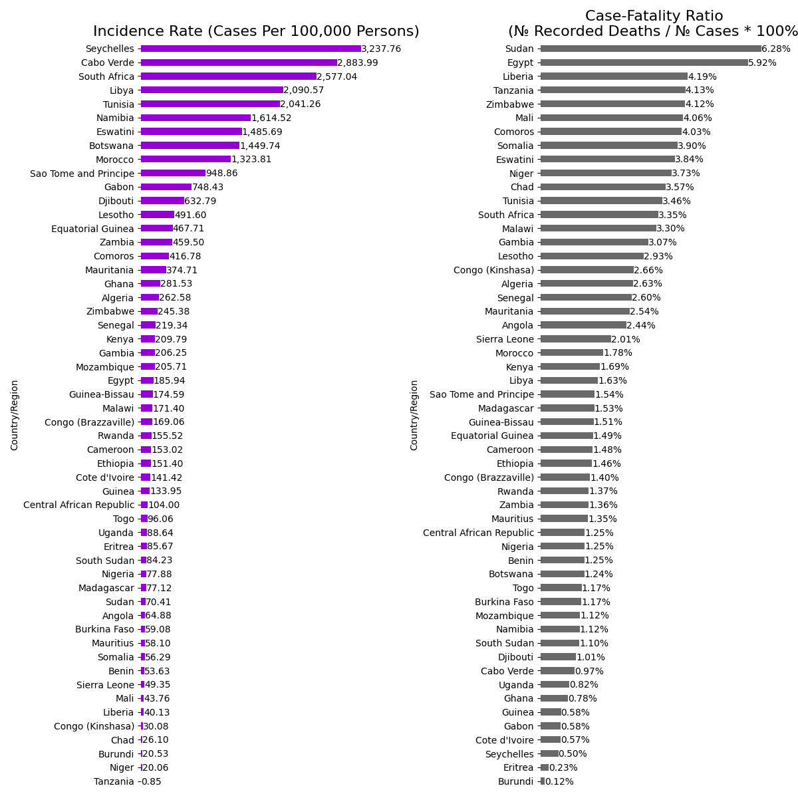

# covid19-in-africa

`covid19-in-africa` is a dataset repository for COVID-19 cases in Africa. We Load the data from the _Johns Hopkins University Center for Systems Science and Engineering_ (JHU CSSE) [CSSEGISandData /
COVID-19 GitHub repository](https://github.com/CSSEGISandData/COVID-19/tree/master/csse_covid_19_data).

## Changelog

**Changes**:

Full changelog: [`CHANGELOG.md`](CHANGELOG.md)

The workflows that update the datasets are defined in `.github/workflows`. The python scripts are scheduled to run on GitHub Actions.

## Datasets

The **tabular data** files are located in the `datasets` folder (_sample head as of Nov 28, 2020_). The folder `dataset/daily` holds the daily updates for each country.

Country/Region | Date       | Confirmed | Deaths | Recovered | Active | Incidence Rate | Case - Fatality Ratio
-------------- | ---------- | --------- | ------ | --------- | ------ | ------------- | -------------------
South Africa   | 11-28-2020 | 785139    | 21439  | 723347    | 40353  | 1323.81780815 | 2.730599295156654
Morocco        | 11-28-2020 | 349688    | 5739   | 298574    | 45375  | 947.392884172 | 1.6411772780307017
Egypt          | 11-28-2020 | 115183    | 6621   | 102490    | 6072   | 112.555501008 | 5.748244098521483
Ethiopia       | 11-28-2020 | 108930    | 1695   | 68250     | 38985  | 94.7517441241 | 1.5560451666207655
Tunisia        | 11-28-2020 | 94980     | 3153   | 69226     | 22601  | 803.647262311 | 3.3196462413139614
Kenya          | 11-28-2020 | 82605     | 1445   | 54399     | 26761  | 153.622843413 | 1.7492887839719145

## Scrapers

The scripts that are used to update the data are located in the `scripts` folder. Create a virtual environment and run:

    pip install -r scripts/requirements.txt
    python scripts/update_datasets.py

to install the requirements, and save the latest available data.

## Community

**Bugs and requests**: PRs are welcome.

## License

The source code is licensed under the MIT license.
