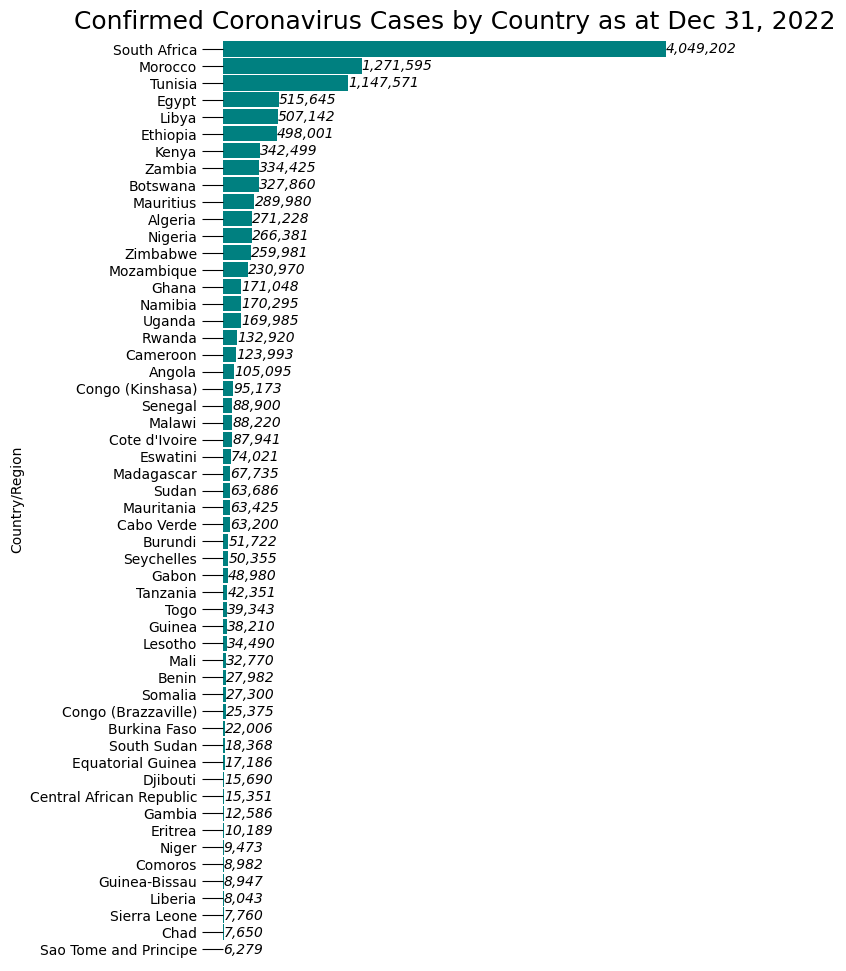
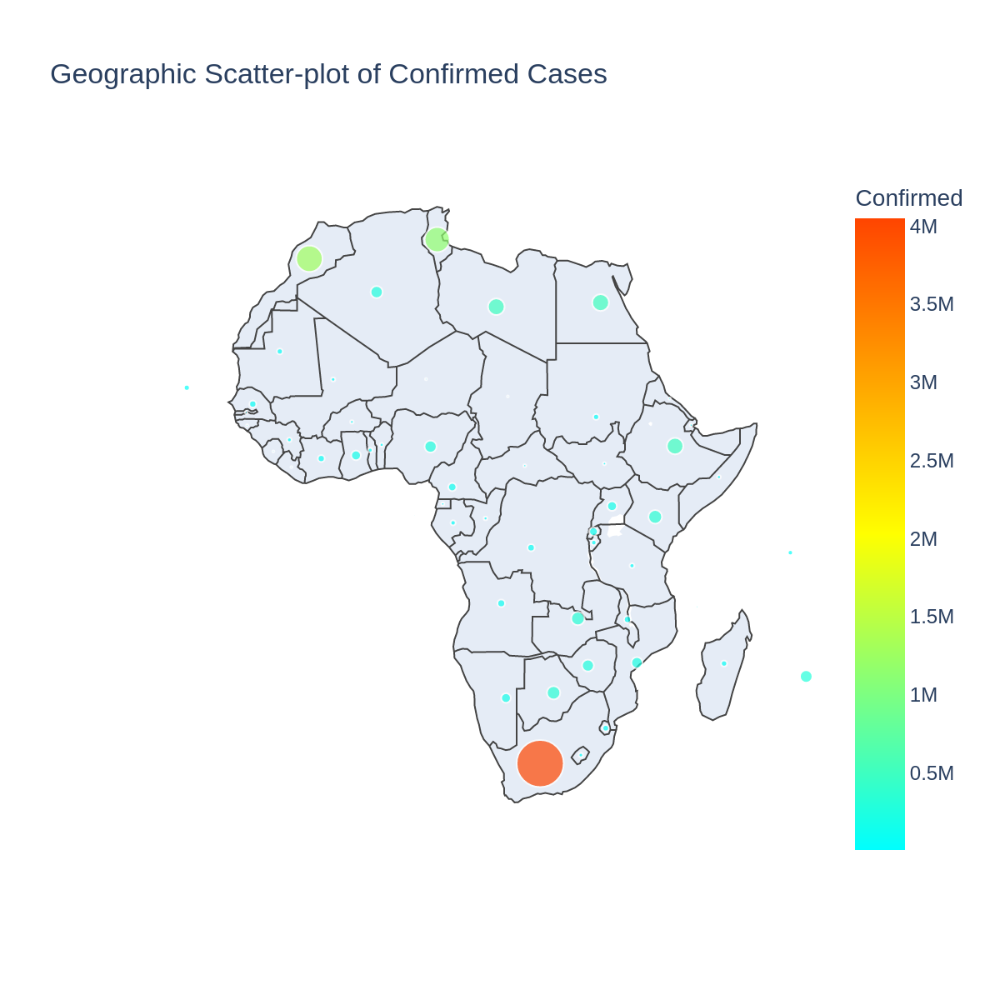

# covid19-in-africa

`covid19-in-africa` is a dataset repository for COVID-19 cases in Africa. We Load data from Johns Hopkins University Center for Systems Science and Engineering [(JHU CSSE) GitHub](https://github.com/CSSEGISandData/COVID-19/tree/master/csse_covid_19_data).

## Changelog

**Changes**:
> TODO

Full changelog: [`CHANGELOG.md`](CHANGELOG.md) - TODO

## Update Status

**Commit Status**:

**Workflow status by countries**:

| Country | Status | Data Source |
| ------------- | ------------- | --- |

> TODO

## [Dataset](https://github.com/4bic/covid19-in-africa/tree/master/datasets)

### Tabular Data

The **tabular data** files are located in `dataset` folder (_sample head as of Jul-03_). The folder `dataset/daily` holds the daily updates in each country.

<!-- > The metadata for the tabular data is found in `.dataherb/metadata.yml`. -->
| Country | 07-02-2020_confirmed | 07-02-2020_deaths | 07-02-2020_recovered
| ------------- | ------------- | --- | ------------- |
| Algeria | 14657 | 928 | 10342
| Angola | 315 | 17 | 97
| Benin | 1199 | 21 | 333
| Burkina Faso | 967 | 53 | 846
| Cameroon | 12592 | 313 | 10100

<!-- ### Other Data

Some of the countries publish more than simple tabular data. We cache the files in `documents` folder. -->

### Scrapers

The scripts that are being used to update the data are located in `scripts` folder. Create a new environment and run `pip install -r requirements.txt` to install the requirements.

### Workflows

The workflows that update the dataset are defined in `.github/workflows`. The python scripts are scheduled to run on GitHub Actions.

## Community

**Bugs and requests**: PRs are welcome.

## License

The source code is licensed under MIT license
